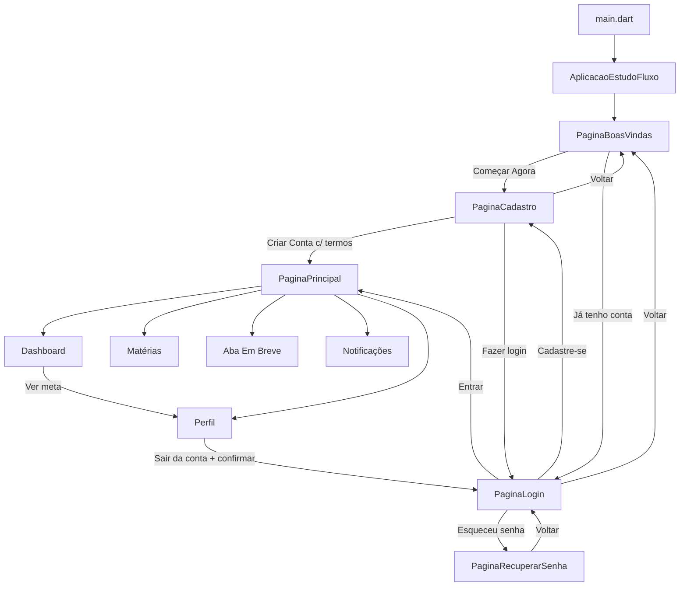

# Documentação Técnica - StudyFlow (Flutter)

## 1) Visão geral da arquitetura

O projeto segue uma arquitetura **modular por funcionalidades** dentro de `lib/funcionalidades`, com separação clara entre camadas e módulos transversais:

- `app`: composição do app (`MaterialApp`) e shell principal da experiência autenticada.
- `coordinator`: orquestração de navegação centralizada (`CoordenadorNavegacao`) e enum de rotas.
- `core`: elementos reutilizáveis globais (tema, cores, strings, utilitários e widgets compartilhados).
- `funcionalidades`: módulos funcionais (boas-vindas, login, cadastro, dashboard, matérias, notificações, perfil), cada um com seus `presentation`, `domain`, `data` ou `model` quando aplicável.

### Padrão adotado hoje

- **Presentation-first por funcionalidade**: a maior parte do código está em UI/widgets com estado local.
- **Domain/Data enxutos**: models e dados mockados locais (sem repositórios/serviços remotos no estado atual).
- **Coordenação de navegação desacoplada da UI**: telas invocam `context.coordenador`/`EscopoCoordenadorNavegacao`.
- **Design system local em `core`**: cores, textos e tema centralizados.

### Responsabilidade por camada

| Camada | Diretório(s) | Responsabilidade |
|---|---|---|
| App | `lib/app` | Configuração da casca da aplicação autenticada e composição de abas (`PaginaPrincipal`). |
| Coordinator | `lib/coordinator` | Regras de navegação (push/pushReplacement/maybePop), enum de rotas e injeção simples do coordenador. |
| Core | `lib/core` | Design system (`cores_aplicacao`, `tema_aplicacao`, `textos_aplicacao`), utilitários (`formatador_data`) e widgets compartilhados. |
| Funcionalidades - Presentation | `lib/funcionalidades/**/presentation` | Páginas, widgets visuais, callbacks e estado local com `StatefulWidget`/`setState`. |
| Funcionalidades - Domain/Model | `lib/funcionalidades/**/domain` e `.../model` | Entidades (`Notificacao`, `Materia`, `MetaEstudo`, `EtapaMeta`) e regras simples derivadas (ex.: progresso). |
| Funcionalidades - Data | `lib/funcionalidades/notificacoes/data` | Seed local de dados e helpers de contagem/badge de notificações. |

### Relação entre dependências internas

- `main.dart` inicia `AplicacaoEstudoFluxo`.
- `AplicacaoEstudoFluxo` aplica tema global, define home (`PaginaBoasVindas`) e injeta `CoordenadorNavegacao` via `EscopoCoordenadorNavegacao`.
- Telas usam:
  - `context.coordenador` para transições de alto nível (boas-vindas/login/cadastro/dashboard/sair).
  - `Navigator` direto para fluxo pontual de recuperação de senha.
- `PaginaPrincipal` centraliza estado compartilhado entre abas:
  - índice da barra inferior;
  - lista de notificações e badge de não lidas;
  - coordenação Dashboard -> Perfil (atalho para seção de metas).

---

## 2) Estrutura completa de pastas (a partir de `lib/`)

## Tree view

```text
lib/
├─ app/
│  ├─ aplicacao_estudo_fluxo.dart
│  └─ pagina_principal.dart
├─ coordinator/
│  ├─ coordenador_navegacao.dart
│  ├─ injetor_aplicacao.dart
│  └─ rotas_navegacao.dart
├─ core/
│  ├─ strings/
│  │  └─ textos_aplicacao.dart
│  ├─ theme/
│  │  ├─ cores_aplicacao.dart
│  │  └─ tema_aplicacao.dart
│  ├─ utils/
│  │  └─ formatador_data.dart
│  └─ widgets/
│     ├─ barra_navegacao.dart
│     ├─ botao_principal.dart
│     ├─ cabecalho_logo.dart
│     ├─ dialogo_confirmar_sair_conta.dart
│     └─ item_navegacao.dart
├─ funcionalidades/
│  ├─ boas_vindas/
│  │  └─ presentation/
│  │     ├─ pages/
│  │     │  └─ pagina_boas_vindas.dart
│  │     └─ widgets/
│  │        └─ cartao_funcionalidade.dart
│  ├─ cadastro/
│  │  └─ presentation/
│  │     ├─ pages/
│  │     │  └─ pagina_cadastro.dart
│  │     └─ widgets/
│  │        ├─ cartao_dados_cadastro.dart
│  │        ├─ rodape_login.dart
│  │        ├─ secao_aceite_termos.dart
│  │        └─ texto_links_cadastro.dart
│  ├─ dashboard/
│  │  └─ presentation/
│  │     ├─ pages/
│  │     │  └─ conteudo_dashboard.dart
│  │     └─ widgets/
│  │        ├─ cabecalho_dashboard.dart
│  │        ├─ card_dashboard.dart
│  │        ├─ card_estatistica.dart
│  │        ├─ card_hoje.dart
│  │        ├─ card_progresso_semanal.dart
│  │        ├─ card_proxima_meta.dart
│  │        ├─ card_sequencia.dart
│  │        ├─ linha_estatisticas.dart
│  │        └─ secao_hoje.dart
│  ├─ login/
│  │  └─ presentation/
│  │     ├─ pages/
│  │     │  ├─ pagina_login.dart
│  │     │  └─ pagina_recuperar_senha.dart
│  │     └─ widgets/
│  │        ├─ cartao_credenciais.dart
│  │        ├─ layout_scroll_autenticacao.dart
│  │        ├─ rodape_cadastro.dart
│  │        └─ secao_login_social.dart
│  ├─ materias/
│  │  ├─ domain/
│  │  │  └─ materia.dart
│  │  └─ presentation/
│  │     ├─ pages/
│  │     │  └─ conteudo_materias.dart
│  │     └─ widgets/
│  │        ├─ cabecalho_materias.dart
│  │        ├─ card_materia.dart
│  │        └─ dialogo_formulario_materia.dart
│  ├─ notificacoes/
│  │  ├─ data/
│  │  │  └─ notificacoes_iniciais.dart
│  │  ├─ domain/
│  │  │  └─ models/
│  │  │     └─ notificacao.dart
│  │  └─ presentation/
│  │     ├─ pages/
│  │     │  └─ notifications_page.dart
│  │     └─ widgets/
│  │        ├─ cabecalho_notificacoes.dart
│  │        └─ card_notificacao.dart
│  └─ perfil/
│     ├─ model/
│     │  └─ meta_estudo.dart
│     └─ presentation/
│        ├─ pages/
│        │  └─ conteudo_perfil.dart
│        └─ widgets/
│           ├─ cabecalho_perfil.dart
│           ├─ cartao_conquista.dart
│           ├─ cartao_meta_ativa.dart
│           ├─ cartao_meta_concluida.dart
│           ├─ cartao_perfil_usuario.dart
│           ├─ dialogo_formulario_meta.dart
│           ├─ secao_conquistas.dart
│           └─ secao_minhas_metas.dart
└─ main.dart
```

## Papel técnico de cada arquivo

### `lib/main.dart`

| Arquivo | Papel |
|---|---|
| `main.dart` | Entrypoint; executa `runApp(const AplicacaoEstudoFluxo())`. |

### `lib/app`

| Arquivo | Papel |
|---|---|
| `aplicacao_estudo_fluxo.dart` | Configura `MaterialApp` (tema, título, home) e injeta `EscopoCoordenadorNavegacao`. |
| `pagina_principal.dart` | Shell autenticado com `IndexedStack` de abas, `BarraNavegacao`, estado de notificações e ponte Dashboard -> Perfil (metas). |

### `lib/coordinator`

| Arquivo | Papel |
|---|---|
| `coordenador_navegacao.dart` | API central de navegação (`mostrarLogin`, `mostrarCadastro`, `mostrarDashboard`, `sairConta`, `voltar`) via `Navigator` root. |
| `injetor_aplicacao.dart` | Injeção simples (singleton local) com instância de `CoordenadorNavegacao`. |
| `rotas_navegacao.dart` | Enum de rotas nomeadas (`/`, `/login`, `/cadastro`, `/dashboard`). |

### `lib/core/strings`

| Arquivo | Papel |
|---|---|
| `textos_aplicacao.dart` | Catálogo central de strings da UI em enum (`TextosAplicacao`). |

### `lib/core/theme`

| Arquivo | Papel |
|---|---|
| `cores_aplicacao.dart` | Paleta central do app com constantes de cor para layout e componentes. |
| `tema_aplicacao.dart` | Constrói `ThemeData` Material 3 + `GoogleFonts.nunitoTextTheme`. |

### `lib/core/utils`

| Arquivo | Papel |
|---|---|
| `formatador_data.dart` | Funções de parsing/format (`dd/MM/yyyy`, por extenso, dias restantes) e formatter de máscara de data (`MascaraDataCurta`). |

### `lib/core/widgets`

| Arquivo | Papel |
|---|---|
| `barra_navegacao.dart` | Barra inferior customizada com 5 itens e badge de notificações. |
| `item_navegacao.dart` | Item individual da barra inferior (ícone, seleção, badge, callback). |
| `botao_principal.dart` | Botão primário reutilizável (`FilledButton`) com estilo padrão e ícone opcional. |
| `cabecalho_logo.dart` | Cabeçalho com logo central e botão de voltar opcional. |
| `dialogo_confirmar_sair_conta.dart` | Dialog de confirmação de logout usado no perfil. |

### `lib/funcionalidades/boas_vindas`

| Arquivo | Papel |
|---|---|
| `presentation/pages/pagina_boas_vindas.dart` | Tela de entrada visual do app; navega para cadastro/login. |
| `presentation/widgets/cartao_funcionalidade.dart` | Card reutilizável para destacar benefícios na tela de boas-vindas. |

### `lib/funcionalidades/cadastro`

| Arquivo | Papel |
|---|---|
| `presentation/pages/pagina_cadastro.dart` | Tela de cadastro com formulário, aceite de termos e transições para login/dashboard. |
| `presentation/widgets/cartao_dados_cadastro.dart` | Formulário visual de nome/email/senha/confirmar senha. |
| `presentation/widgets/rodape_login.dart` | Rodapé com link para login e aviso legal (termos/política). |
| `presentation/widgets/secao_aceite_termos.dart` | Checkbox + texto com links de termos/política. |
| `presentation/widgets/texto_links_cadastro.dart` | Componente base para compor textos com partes clicáveis. |

### `lib/funcionalidades/dashboard`

| Arquivo | Papel |
|---|---|
| `presentation/pages/conteudo_dashboard.dart` | Conteúdo da aba Dashboard; compõe cards/estatísticas e CTA principal. |
| `presentation/widgets/cabecalho_dashboard.dart` | Saudação e data atual formatada. |
| `presentation/widgets/card_dashboard.dart` | Wrapper visual base para cards do dashboard/materias/perfil. |
| `presentation/widgets/card_estatistica.dart` | Card pequeno de estatística (ícone, valor, rótulo). |
| `presentation/widgets/card_hoje.dart` | Card de métrica da seção "Hoje". |
| `presentation/widgets/card_progresso_semanal.dart` | Card de progresso semanal com barra e rótulos de dias. |
| `presentation/widgets/card_proxima_meta.dart` | Card "Próxima meta" com CTA "Ver". |
| `presentation/widgets/card_sequencia.dart` | Card de sequência atual de estudos. |
| `presentation/widgets/linha_estatisticas.dart` | Linha horizontal com 4 `CardEstatistica`. |
| `presentation/widgets/secao_hoje.dart` | Bloco "Hoje" composto por dois `CardHoje`. |

### `lib/funcionalidades/login`

| Arquivo | Papel |
|---|---|
| `presentation/pages/pagina_login.dart` | Tela de login, incluindo links para cadastro e recuperar senha. |
| `presentation/pages/pagina_recuperar_senha.dart` | Tela de recuperação de senha (fluxo local com snackbars). |
| `presentation/widgets/cartao_credenciais.dart` | Card com campos de email/senha e toggle de visibilidade. |
| `presentation/widgets/layout_scroll_autenticacao.dart` | Layout scroll reutilizável para telas de autenticação. |
| `presentation/widgets/rodape_cadastro.dart` | Rodapé do login com link "Cadastre-se". |
| `presentation/widgets/secao_login_social.dart` | Separador + botões sociais (atualmente em modo "em breve"). |

### `lib/funcionalidades/materias`

| Arquivo | Papel |
|---|---|
| `domain/materia.dart` | Entidade `Materia` com `copyWith`. |
| `presentation/pages/conteudo_materias.dart` | Aba de matérias com lista local mutável, criação/edição/exclusão. |
| `presentation/widgets/cabecalho_materias.dart` | Cabeçalho da aba e botão para adicionar nova matéria. |
| `presentation/widgets/card_materia.dart` | Card de matéria com progresso, horas e ações editar/excluir. |
| `presentation/widgets/dialogo_formulario_materia.dart` | Dialog de nova/edição de matéria e DTO de retorno. |

### `lib/funcionalidades/notificacoes`

| Arquivo | Papel |
|---|---|
| `data/notificacoes_iniciais.dart` | Seed local de notificações + helpers de contagem/flag de não lidas. |
| `domain/models/notificacao.dart` | Entidade `Notificacao` com `copiarCom`. |
| `presentation/pages/notifications_page.dart` | Tela de notificações em modo embutido (aba) ou standalone (scaffold próprio). |
| `presentation/widgets/cabecalho_notificacoes.dart` | Cabeçalho com título e subtítulo dinâmico de não lidas. |
| `presentation/widgets/card_notificacao.dart` | Card de notificação com estado visual lida/não lida e ações. |

### `lib/funcionalidades/perfil`

| Arquivo | Papel |
|---|---|
| `model/meta_estudo.dart` | Entidades `MetaEstudo` e `EtapaMeta`, com getters de progresso e `copyWith`. |
| `presentation/pages/conteudo_perfil.dart` | Aba de perfil; gerencia metas ativas/concluídas, conquistas e ações de conta. |
| `presentation/widgets/cabecalho_perfil.dart` | Cabeçalho textual do perfil. |
| `presentation/widgets/cartao_conquista.dart` | Card visual de conquista. |
| `presentation/widgets/cartao_meta_ativa.dart` | Card de meta ativa com checklist de etapas e ações (editar/concluir/excluir). |
| `presentation/widgets/cartao_meta_concluida.dart` | Card de meta concluída com ação de remover. |
| `presentation/widgets/cartao_perfil_usuario.dart` | Card de dados do usuário e botões de configurações/logout. |
| `presentation/widgets/dialogo_formulario_meta.dart` | Dialog para criar/editar meta com campos, etapas e prazo. |
| `presentation/widgets/secao_conquistas.dart` | Seção com três cards de conquistas. |
| `presentation/widgets/secao_minhas_metas.dart` | Seção agregadora de metas ativas/concluídas e callbacks de ação. |

---

## 3) Fluxo de navegação da aplicação

### Ponto de entrada e inicialização

1. `main.dart` chama `runApp(const AplicacaoEstudoFluxo())`.
2. `AplicacaoEstudoFluxo` monta `MaterialApp`:
   - `theme: construirTemaAplicacao()`
   - `home: const PaginaBoasVindas()`
   - `builder`: injeta `EscopoCoordenadorNavegacao` com `injecaoAplicacao.coordenador`.

### Rotas e coordenador

- Rotas definidas em `RotasNavegacao`: `/`, `/login`, `/cadastro`, `/dashboard`.
- `CoordenadorNavegacao` encapsula:
  - `mostrarLogin` (`push`)
  - `mostrarCadastro` (`push`)
  - `substituirPorLogin` (`pushReplacement`)
  - `mostrarDashboard` (`pushReplacement`)
  - `sairConta` (`pushReplacement` para login)
  - `voltar` (`maybePop`)

### Relação entre telas principais

- `PaginaBoasVindas`:
  - botão **Começar Agora** -> `mostrarCadastro`.
  - botão **Já tenho conta** -> `mostrarLogin`.
- `PaginaCadastro`:
  - botão voltar no cabeçalho -> `coordenador.voltar`.
  - botão **Criar Conta** (somente com checkbox aceito) -> `mostrarDashboard`.
  - link **Fazer login** -> `substituirPorLogin`.
- `PaginaLogin`:
  - botão voltar -> `coordenador.voltar`.
  - botão **Entrar** -> `mostrarDashboard`.
  - link **Cadastre-se** -> `mostrarCadastro`.
  - link **Esqueceu sua senha?** -> `Navigator.push` para `PaginaRecuperarSenha`.
- `PaginaRecuperarSenha`:
  - botão voltar -> `Navigator.pop`.
  - botão **Continuar** -> exibe `SnackBar` local.
- `PaginaPrincipal` (dashboard autenticado):
  - `IndexedStack` com abas: Dashboard, Matérias, Em Breve, Notificações, Perfil.
  - controla troca de abas via `BarraNavegacao`.
  - aba de notificações recebe lista e callbacks para manter badge sincronizado.
  - dashboard pode abrir seção de metas no perfil (`aoVerMeta` -> muda aba para Perfil + `irParaMetas()`).
- `ConteudoPerfil`:
  - ação sair da conta -> abre dialog `mostrarDialogoConfirmarSairConta`; confirmando, chama `coordenador.sairConta`.

### Barra inferior e botão voltar

- `BarraNavegacao` dispara `aoTocar(indice)` em `PaginaPrincipal`.
- Índices aceitos diretamente: 0 (home/dashboard), 1 (matérias), 3 (notificações), 4 (perfil).
- Índice 2 abre snackbar "funcionalidade em breve", mantendo aba atual.
- Badge de notificação é derivado de `temNotificacoesNaoLidas`.
- Em `NotificationsPage` standalone (`embutida = false`), tocar:
  - índice 3: permanece na tela;
  - índice 0: `Navigator.maybePop`;
  - demais: snackbar "em breve".

### Fluxo textual (Mermaid)



---

## 4) Documentação técnica de cada tela

## Tela de boas-vindas

| Item | Detalhe |
|---|---|
| Widget | `PaginaBoasVindas` |
| Arquivo | `lib/funcionalidades/boas_vindas/presentation/pages/pagina_boas_vindas.dart` |
| Tipo | `StatelessWidget` |
| Responsabilidade | Apresentação inicial do produto e entrada para fluxos de autenticação. |
| Widgets filhos principais | `CabecalhoLogo`, 3x `CartaoFuncionalidade`, `BotaoPrincipal`, `OutlinedButton`. |
| Parâmetros recebidos | Nenhum. |
| Estado interno | Não possui. |
| Navegação | `Começar Agora` -> cadastro; `Já tenho conta` -> login. |

## Tela de login

| Item | Detalhe |
|---|---|
| Widget | `PaginaLogin` |
| Arquivo | `lib/funcionalidades/login/presentation/pages/pagina_login.dart` |
| Tipo | `StatefulWidget` |
| Responsabilidade | Captura credenciais e direciona para dashboard, cadastro ou recuperação de senha. |
| Widgets filhos principais | `CabecalhoLogo`, `CartaoCredenciais`, `BotaoPrincipal`, `SecaoLoginSocial`, `RodapeCadastro`. |
| Parâmetros recebidos | Nenhum. |
| Callbacks principais | `_aoEntrar`, `_aoEsqueceuSenha`, `_mostrarEmBreve`. |
| Estado interno | `TextEditingController` de email/senha. |
| Navegação | Entrar -> dashboard; Cadastre-se -> cadastro; Esqueceu senha -> `PaginaRecuperarSenha`; voltar -> `coordenador.voltar`. |

## Tela de recuperar senha

| Item | Detalhe |
|---|---|
| Widget | `PaginaRecuperarSenha` |
| Arquivo | `lib/funcionalidades/login/presentation/pages/pagina_recuperar_senha.dart` |
| Tipo | `StatefulWidget` |
| Responsabilidade | Receber email para recuperação e exibir feedback por snackbar. |
| Widgets filhos principais | `CabecalhoLogo`, `TextFormField`, `BotaoPrincipal`, card informativo de segurança. |
| Parâmetros recebidos | Nenhum. |
| Estado interno | `TextEditingController` de email. |
| Navegação | Voltar por `Navigator.pop`. |

## Tela de dashboard (aba)

| Item | Detalhe |
|---|---|
| Widget | `ConteudoDashboard` |
| Arquivo | `lib/funcionalidades/dashboard/presentation/pages/conteudo_dashboard.dart` |
| Tipo | `StatelessWidget` |
| Responsabilidade | Exibir métricas e atalhos de estudo/meta na aba inicial da área autenticada. |
| Parâmetros recebidos | `aoMostrarEmBreve`, `aoVerMeta`. |
| Widgets filhos principais | `CabecalhoDashboard`, `SecaoHoje`, `CardSequencia`, `CardProgressoSemanal`, `LinhaEstatisticas`, `CardProximaMeta`, `BotaoPrincipal`. |
| Navegação/integração | `aoVerMeta` é delegado ao pai (`PaginaPrincipal`) para trocar para aba Perfil e focar metas. |

## Tela de perfil (aba)

| Item | Detalhe |
|---|---|
| Widget | `ConteudoPerfil` |
| Arquivo | `lib/funcionalidades/perfil/presentation/pages/conteudo_perfil.dart` |
| Tipo | `StatefulWidget` |
| Responsabilidade | Gestão de perfil, metas ativas/concluídas e ações de conta. |
| Parâmetros recebidos | `aoMostrarEmBreve`, `aoSairConta`. |
| Widgets filhos principais | `CabecalhoPerfil`, `CartaoPerfilUsuario`, `SecaoConquistas`, `SecaoMinhasMetas`. |
| Estado interno | `ScrollController`, listas `_metasAtivas` e `_metasConcluidas`, `GlobalKey` da seção de metas. |
| Callbacks principais | criar/editar meta, alternar etapas, concluir meta, excluir/remover. |
| Integração | Exposto `irParaMetas()` para acionamento remoto via `GlobalKey` por `PaginaPrincipal`. |

## Tela de notificações

| Item | Detalhe |
|---|---|
| Widget | `NotificationsPage` |
| Arquivo | `lib/funcionalidades/notificacoes/presentation/pages/notifications_page.dart` |
| Tipo | `StatefulWidget` |
| Responsabilidade | Listar, marcar como lida e remover notificações. |
| Modos | Embutido (`embutida=true`) no `IndexedStack` ou standalone com scaffold próprio. |
| Parâmetros recebidos | `embutida`, `aoTocarBarra`, `notificacoes`, `aoMarcarComoLida`, `aoRemover`. |
| Estado interno | Lista local `_notificacoesLocais` (quando não controlado pelo ancestral). |
| Callbacks | `_marcarComoLida`, `_remover`, `_aoTocarBarra`. |
| Integração | Em modo embutido, estado vem de `PaginaPrincipal` para sincronizar badge da barra inferior. |

## Tela de cadastro

| Item | Detalhe |
|---|---|
| Widget | `PaginaCadastro` |
| Arquivo | `lib/funcionalidades/cadastro/presentation/pages/pagina_cadastro.dart` |
| Tipo | `StatefulWidget` |
| Responsabilidade | Cadastro de conta com aceite de termos e redirecionamento para dashboard/login. |
| Widgets filhos principais | `CabecalhoLogo`, `CartaoDadosCadastro`, `SecaoAceiteTermos`, `BotaoPrincipal`, `RodapeLogin`. |
| Estado interno | Controladores de formulário + bool `_aceitouTermos`. |
| Navegação | Criar conta -> dashboard; Fazer login -> substitui para login; voltar -> maybePop. |

## Tela principal autenticada (container)

| Item | Detalhe |
|---|---|
| Widget | `PaginaPrincipal` |
| Arquivo | `lib/app/pagina_principal.dart` |
| Tipo | `StatefulWidget` |
| Responsabilidade | Orquestrar abas, barra inferior e estado compartilhado entre dashboard/perfil/notificações. |
| Estado interno | `_indiceNavegacao`, `_notificacoes`, `_chavePerfil`. |
| Integrações | Dashboard -> Perfil (metas), Perfil -> logout via coordenador, Notificações -> badge e contagem centralizadas. |

---

## 5) Estrutura de widgets reutilizáveis

## Widgets compartilhados globais (`core`)

| Widget | Localização | Finalidade | Parâmetros obrigatórios | Opcionais | Reuso atual |
|---|---|---|---|---|---|
| `BarraNavegacao` | `lib/core/widgets/barra_navegacao.dart` | Barra inferior com 5 itens e badge. | `indiceAtual`, `aoTocar` | `temNotificacoesNaoLidas` | `PaginaPrincipal`, `NotificationsPage` (modo standalone). |
| `ItemNavegacao` | `lib/core/widgets/item_navegacao.dart` | Item individual da barra. | `icone`, `selecionado`, `aoTocar` | `mostrarBadge` | Usado por `BarraNavegacao`. |
| `BotaoPrincipal` | `lib/core/widgets/botao_principal.dart` | CTA principal padronizado. | `rotulo`, `temaTexto`, `aoPressionar` | `iconePrefixo` | Boas-vindas, login, cadastro, dashboard, recuperar senha. |
| `CabecalhoLogo` | `lib/core/widgets/cabecalho_logo.dart` | Cabeçalho com logo e voltar opcional. | - | `aoVoltar`, `alturaLogo`, `iconeVoltar`, `caminhoLogo` | Boas-vindas, login, cadastro, recuperar senha. |
| `mostrarDialogoConfirmarSairConta` | `lib/core/widgets/dialogo_confirmar_sair_conta.dart` | Confirmar logout com `AlertDialog`. | `BuildContext` | - | `PaginaPrincipal` (via callback de perfil). |

## Widgets reutilizáveis por funcionalidade

| Widget | Localização | Finalidade | Parâmetros obrigatórios | Opcionais | Reuso |
|---|---|---|---|---|---|
| `CartaoFuncionalidade` | `boas_vindas/.../cartao_funcionalidade.dart` | Item descritivo de feature na onboarding screen. | `icone`, `titulo`, `subtitulo`, `temaTexto` | - | `PaginaBoasVindas`. |
| `LayoutScrollAutenticacao` | `login/.../layout_scroll_autenticacao.dart` | Layout padrão scroll/top para autenticação. | `filhos` | - | `PaginaLogin`, `PaginaRecuperarSenha`. |
| `CartaoCredenciais` | `login/.../cartao_credenciais.dart` | Form de email/senha com toggle de senha. | `controladorEmail`, `controladorSenha`, `temaTexto` | `aoEsqueceuSenha` | `PaginaLogin`. |
| `RodapeCadastro` | `login/.../rodape_cadastro.dart` | Link para cadastro no login. | `temaTexto` | `aoCadastrese` | `PaginaLogin`. |
| `SecaoLoginSocial` | `login/.../secao_login_social.dart` | Bloco social com botões (placeholder). | `temaTexto`, `aoAutenticacaoSocial` | - | `PaginaLogin`. |
| `TextoLinksCadastro` | `cadastro/.../texto_links_cadastro.dart` | Texto composto com trechos clicáveis. | `temaTexto`, `partes` | `tamanhoFonte`, `corTexto`, `alturaLinha`, `alinhamento` | `SecaoAceiteTermos`, `RodapeLogin`. |
| `SecaoAceiteTermos` | `cadastro/.../secao_aceite_termos.dart` | Checkbox + links termos/política. | `temaTexto`, `aceito`, `aoAlterarAceite` | `aoTermosUso`, `aoPoliticaPrivacidade` | `PaginaCadastro`. |
| `RodapeLogin` | `cadastro/.../rodape_login.dart` | Rodapé com link para login e aviso legal. | `temaTexto` | `aoEntrar`, `aoTermosUso`, `aoPoliticaPrivacidade` | `PaginaCadastro`. |
| `CartaoDadosCadastro` | `cadastro/.../cartao_dados_cadastro.dart` | Formulário visual de cadastro. | controladores + `temaTexto` | - | `PaginaCadastro`. |
| `CardDashboard` | `dashboard/.../card_dashboard.dart` | Base visual de card com sombra e borda arredondada. | `filho` | `cor`, `preenchimento`, `raioBorda` | Dashboard, matérias, perfil. |
| `CardEstatistica` | `dashboard/.../card_estatistica.dart` | KPI compacto. | `icone`, `corIcone`, `valor`, `rotulo`, `temaTexto` | - | `LinhaEstatisticas`. |
| `CardHoje` | `dashboard/.../card_hoje.dart` | Valor + rótulo na seção de hoje. | `valor`, `rotulo`, `temaTexto` | - | `SecaoHoje`. |
| `CardProgressoSemanal` | `dashboard/.../card_progresso_semanal.dart` | Exibição de progresso semanal fixo. | `temaTexto` | - | `ConteudoDashboard`. |
| `CardProximaMeta` | `dashboard/.../card_proxima_meta.dart` | Card da próxima meta com CTA. | `temaTexto`, `aoVer` | - | `ConteudoDashboard`. |
| `CardSequencia` | `dashboard/.../card_sequencia.dart` | Card da sequência atual. | `temaTexto` | - | `ConteudoDashboard`. |
| `CabecalhoDashboard` | `dashboard/.../cabecalho_dashboard.dart` | Saudação + data. | `temaTexto` | - | `ConteudoDashboard`. |
| `CabecalhoMaterias` | `materias/.../cabecalho_materias.dart` | Título/subtítulo dinâmico + adicionar. | `temaTexto`, `quantidadeMaterias`, `aoAdicionar` | - | `ConteudoMaterias`. |
| `CardMateria` | `materias/.../card_materia.dart` | Exibição de matéria e ações CRUD. | `materia`, `temaTexto`, `aoEditar`, `aoExcluir` | - | `ConteudoMaterias`. |
| `CabecalhoNotificacoes` | `notificacoes/.../cabecalho_notificacoes.dart` | Título + contador de não lidas. | `temaTexto`, `quantidadeNaoLidas` | - | `NotificationsPage`. |
| `CardNotificacao` | `notificacoes/.../card_notificacao.dart` | Card de notificação com ação de leitura/exclusão. | `notificacao`, `temaTexto`, `aoMarcarComoLida`, `aoExcluir` | - | `NotificationsPage`. |
| `CabecalhoPerfil` | `perfil/.../cabecalho_perfil.dart` | Título/subtítulo do perfil. | `temaTexto` | - | `ConteudoPerfil`. |
| `CartaoPerfilUsuario` | `perfil/.../cartao_perfil_usuario.dart` | Dados do usuário + botões de config/logout. | `temaTexto`, `aoConfiguracoes`, `aoSair` | - | `ConteudoPerfil`. |
| `BotaoPerfilContorno` | `perfil/.../cartao_perfil_usuario.dart` | Botão contornado reutilizado no cartão de perfil. | `corBorda`, `aoPressionar`, `altura`, `filho` | - | Interno de `CartaoPerfilUsuario`. |
| `SecaoConquistas` | `perfil/.../secao_conquistas.dart` | Lista visual de conquistas. | `temaTexto` | - | `ConteudoPerfil`. |
| `CartaoConquista` | `perfil/.../cartao_conquista.dart` | Card individual de conquista. | `temaTexto`, `rotulo`, `corFundo`, `icone`, `corIcone` | - | `SecaoConquistas`. |
| `SecaoMinhasMetas` | `perfil/.../secao_minhas_metas.dart` | Agrega metas ativas/concluídas e encaminha callbacks. | múltiplas listas/callbacks + `temaTexto` | - | `ConteudoPerfil`. |
| `CartaoMetaAtiva` | `perfil/.../cartao_meta_ativa.dart` | Detalhes de meta ativa + checklist + ações. | `meta`, `temaTexto`, callbacks | - | `SecaoMinhasMetas`. |
| `CartaoMetaConcluida` | `perfil/.../cartao_meta_concluida.dart` | Exibe meta concluída com ação remover. | `meta`, `temaTexto`, `aoRemover` | - | `SecaoMinhasMetas`. |

---

## 6) Models / entidades

| Model | Arquivo | Atributos principais | Construtor | Métodos auxiliares |
|---|---|---|---|---|
| `Materia` | `lib/funcionalidades/materias/domain/materia.dart` | `id:String`, `nome:String`, `horasEstudadas:double`, `progressoPercentual:int` | `const Materia(...)` | `copyWith({nome, horasEstudadas, progressoPercentual})`. |
| `Notificacao` | `lib/funcionalidades/notificacoes/domain/models/notificacao.dart` | `id`, `emojiIcone`, `corFundoIcone`, `emojiTitulo`, `titulo`, `descricao`, `tempoRelativo`, `lida` | `const Notificacao(...)` | `copiarCom({lida})`. |
| `EtapaMeta` | `lib/funcionalidades/perfil/model/meta_estudo.dart` | `id:String`, `texto:String`, `concluida:bool` | `const EtapaMeta(...)` | `copyWith({texto, concluida})`. |
| `MetaEstudo` | `lib/funcionalidades/perfil/model/meta_estudo.dart` | `id`, `titulo`, `descricao`, `prazo:DateTime`, `etapas:List<EtapaMeta>`, `concluida` | `const MetaEstudo(...)` | getters `etapasConcluidas`, `valorProgresso`, `rotuloProgressoEtapas`; `copyWith(...)`. |
| `ResultadoFormularioMateria` | `lib/funcionalidades/materias/presentation/widgets/dialogo_formulario_materia.dart` | `nome:String`, `progressoPercentual:int` | `const ResultadoFormularioMateria(...)` | DTO de retorno do diálogo. |
| `ParteTextoCadastro` | `lib/funcionalidades/cadastro/presentation/widgets/texto_links_cadastro.dart` | `texto:String`, `aoPressionar:VoidCallback?` | `const ParteTextoCadastro(...)` | Estrutura de composição de texto com links. |

### Funções de suporte a dados (não classes de entidade)

- `criarNotificacoesIniciais()`: fornece seed local de notificações.
- `contarNotificacoesNaoLidas()` e `temNotificacoesNaoLidas()`: calculam contagem e badge.

### Serialização

No estado atual **não existem métodos de serialização** (`toJson/fromJson`) nem persistência remota/local para os models acima.

---

## 7) Gerenciamento de estado atual

O gerenciamento de estado é **local e imperativo**, baseado em `StatefulWidget` + `setState`, com passagem de dados/callbacks entre pai e filho.

### Padrões encontrados

- Estado local por tela:
  - formulários (`TextEditingController` + bools de UI).
  - coleções mutáveis em memória (`List<Materia>`, `List<Notificacao>`, `List<MetaEstudo>`).
- Elevação de estado quando necessário:
  - `PaginaPrincipal` mantém notificações e injeta na aba de notificações.
  - `NotificationsPage` suporta modo controlado pelo ancestral (callbacks) e modo autônomo (estado próprio).
- Comunicação pai-filho:
  - via `ValueChanged`, `VoidCallback` e objetos de domínio.
- Atualização de UI:
  - badges, contadores, progresso e listas dependem diretamente de `setState`.

### Exemplos concretos

1. **Notificações lidas/não lidas + badge da barra**
   - Fonte de verdade em `PaginaPrincipal` (`_notificacoes`).
   - `BarraNavegacao.temNotificacoesNaoLidas` recebe derivação de `temNotificacoesNaoLidas(...)`.
   - `NotificationsPage` embutida recebe callbacks `aoMarcarComoLida`/`aoRemover`.

2. **Atualização de metas no perfil**
   - `ConteudoPerfil` mantém `_metasAtivas` e `_metasConcluidas`.
   - `SecaoMinhasMetas` dispara callbacks para criar/editar/concluir/remover.
   - `CartaoMetaAtiva` alterna etapas com callback `aoMetaAlterada`.

3. **Compartilhamento Dashboard -> Perfil**
   - `CardProximaMeta` chama `aoVer`.
   - `PaginaPrincipal._irParaMetasNoPerfil` troca aba para perfil e executa `irParaMetas` via `GlobalKey`.

4. **Formulários**
   - Login/cadastro/recuperação/matérias/metas usam controladores locais descartados em `dispose`.

---

## 8) Tema e design system

## Cores (`CoresAplicacao`)

- Arquivo: `lib/core/theme/cores_aplicacao.dart`.
- Centraliza paleta principal:
  - branding: `laranja`, `laranjaSuave`, `marromEscuro`.
  - base: `fundo`, `preenchimentoCampo`, `preto`, tons de cinza.
  - semânticas visuais: `vermelho`, `iconeVerde`, `iconeRoxo`, `iconeAmarelo`, `iconeAzul`.
  - superfícies específicas: `cartaoPessego`, `fundoMetaConcluida`, `conquistaRoxoClaro`, `conquistaAzulClaro`.

## Tema global (`construirTemaAplicacao`)

- Arquivo: `lib/core/theme/tema_aplicacao.dart`.
- Material 3 (`useMaterial3: true`) com `ColorScheme.fromSeed`.
- Tipografia global via `GoogleFonts.nunitoTextTheme`.

## Textos centralizados

- Arquivo: `lib/core/strings/textos_aplicacao.dart`.
- Enum `TextosAplicacao` contém quase todo texto fixo do app (onboarding, auth, dashboard, matérias, perfil etc.).
- Benefício: consistência textual e facilidade de manutenção.

## Padrões visuais reutilizados

- Botão principal padronizado: `BotaoPrincipal`.
- Cards com sombra/bordas arredondadas: `CardDashboard` (base visual amplamente reutilizada).
- Inputs com fundo cinza claro e borda focada laranja em formulários.
- Espaçamentos consistentes com `SizedBox` e padding simétrico.
- Barra inferior translúcida com badge de notificações.

## Utilidades de data

- `formatador_data.dart` unifica:
  - parse/format `dd/MM/yyyy`;
  - máscara de entrada de data;
  - rótulo humano de dias restantes;
  - data por extenso para dashboard.

---

## 9) Dependências externas (`pubspec.yaml`)

### Dependências de runtime

| Dependência | Finalidade | Onde é usada |
|---|---|---|
| `flutter` (sdk) | Framework principal da aplicação. | Todos os arquivos Dart de UI e estrutura. |
| `cupertino_icons` | Ícones estilo iOS (disponibiliza `CupertinoIcons`). | **Não há uso explícito em `lib/` no estado atual**. |
| `google_fonts` | Aplicar tipografia Nunito. | `core/theme/tema_aplicacao.dart`; páginas que chamam `GoogleFonts.nunitoTextTheme(...)` (`pagina_boas_vindas`, `pagina_login`, `pagina_recuperar_senha`, `conteudo_dashboard`, `conteudo_materias`, `notifications_page`, `conteudo_perfil`, `dialogo_formulario_materia`). |

### Dependências de desenvolvimento

| Dependência | Finalidade | Onde impacta |
|---|---|---|
| `flutter_test` | Testes Flutter. | Infra de testes (não há análise de arquivos de teste nesta documentação). |
| `flutter_lints` | Regras de lint recomendadas. | Qualidade estática do código (`analysis_options.yaml`). |

### Assets

| Asset | Uso |
|---|---|
| `assets/logo/logo-studyflow.png` | Renderizado por `CabecalhoLogo`. |

---

## 10) Pontos de atenção técnicos para manutenção

### Áreas centrais e sensíveis

- `lib/app/pagina_principal.dart` é o hub de estado entre abas; mudanças aqui afetam navegação, badge e integração dashboard/perfil/notificações.
- `lib/coordinator/coordenador_navegacao.dart` concentra transições principais; alterações podem quebrar fluxo de autenticação.
- `lib/core/strings/textos_aplicacao.dart` impacta múltiplas telas simultaneamente.
- `lib/core/theme/cores_aplicacao.dart` e `card_dashboard.dart` influenciam consistência visual global.

### Acoplamentos observados

- `ConteudoPerfil` expõe método por `GlobalKey` para scroll programático (dependência explícita de implementação concreta).
- `NotificationsPage` tem dualidade controlado/local (flexível, mas aumenta complexidade condicional).
- Dados iniciais estão embutidos em widgets/data locais (sem camada de persistência/repositório).

### Riscos de regressão comuns

- Fluxo de navegação híbrido (coordenador + `Navigator` direto na recuperação de senha).
- Mudanças em índices da barra inferior exigem atualização sincronizada em `PaginaPrincipal`, `BarraNavegacao` e, potencialmente, `NotificationsPage`.
- Mudanças no model de metas impactam `dialogo_formulario_meta`, `cartao_meta_ativa` e `secao_minhas_metas`.

### Melhorias arquiteturais possíveis (baseadas no estado atual)

- Introduzir camada de estado dedicada (ex.: `ChangeNotifier`, `Riverpod`, `Bloc`) para reduzir `setState` distribuído.
- Criar abstração de dados/repositório para remover seeds locais hardcoded.
- Unificar toda navegação por coordenador (incluindo recuperar senha) para consistência.
- Padronizar nomenclatura de idioma em nomes de arquivos/classes (hoje há mistura PT + EN, ex.: `notifications_page.dart`).

### Dependências entre módulos (resumo)

- `app` depende de `coordinator`, `core` e diversas `funcionalidades`.
- `funcionalidades/*/presentation` depende de `core` + seus próprios `model/domain`.
- `notificacoes` depende de `data` para seed local.
- `perfil` depende de `core/utils/formatador_data.dart` para cálculo/format de prazo.

---

## Observações finais

- Esta documentação foi gerada exclusivamente a partir do código atual em `lib/` e `pubspec.yaml`.
- Não foram inferidas integrações externas (API, banco, autenticação real) porque elas não existem no estado atual do código.
